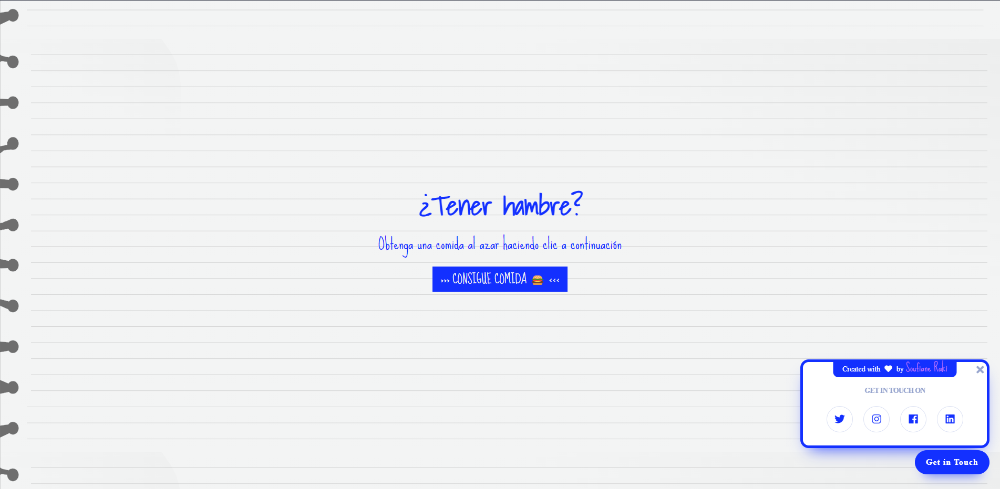

# Recetas al azar #001

<p align="center"><a href="https://laravel.com" target="_blank"></a></p>

<p align="center">
<a href=""></a>
<a href=""></a>
<a href=""></a>
</p>

Para ello he optado por utilizar la API pública de [TheMealDB](https://www.themealdb.com/) con el fin de obtener algunas comidas al azar pulsando un botón. ¡Algo sencillo!
### El HTML
```html
<div class="home">
    <div id="home">
        <h1 class="title-page">¿Tener hambre?</h1>
        <p>Obtenga una comida al azar haciendo clic a continuación</p>
    </div>
    <div class="topo">
        <a class="topo-button" href="#home" id="get_meal"> >>> CONSIGUE COMIDA 🍔 <<< </a>
    </div>
    <div id="meal" class="row meal">

    </div>
</div>
```
Tenemos un poco de texto, pero las dos partes más importantes son:

- el botón `#get_meal` y
- el div ``#meal``

Vamos a utilizar el ``button`` para hacer una solicitud a la API que enviará de vuelta algunos datos que vamos a poner en el div ``#meal`` que actúa como un contenedor - en este caso.

Por lo general, después de que el HTML que voy en el CSS, pero no tenemos todavía todo el marcado, ya que se rellenará en la sección de JavaScript, así que eso es lo que vamos a hacer a continuación.
### El JavaScript
Como se mencionó anteriormente, necesitamos el botón y ese div contenedor:
```js
const get_meal_btn = document.getElementById('get_meal');
const meal_container = document.getElementById('meal');
```
A continuación, antes de sumergirnos más en el código, vamos a ver qué va a devolver la API. Para ello abre la siguiente URL:

--> https://www.themealdb.com/api/json/v1/1/random.php

Como puedes notar en la URL, estamos obteniendo una comida aleatoria de esta API (refresca para ver la aleatoriedad). Cuando hacemos una petición GET a ese endpoint (como si accediéramos a él desde el navegador), nos devuelve una respuesta JSON, que podemos analizar para recuperar los datos que queremos.

Los datos son algo así:

```json
{
    "meals": [
        {
            "idMeal": "53022",
            "strMeal": "Polskie Naleśniki (Polish Pancakes)",
            "strDrinkAlternate": null,
            "strCategory": "Dessert",
            "strArea": "Polish",
            "strInstructions": "Add flour, eggs, milk, water, and salt in a large bowl then mix with a hand mixer until you have a smooth, lump-free batter.\r\nAt this point, mix in the butter or the vegetable oil. Alternatively, you can use them to grease the pan before frying each pancake.\r\nHeat a non-stick pan over medium heat, then pour in the batter, swirling the pan to help it spread.\r\nWhen the pancake starts pulling away a bit from the sides, and the top is no longer wet, flip it and cook shortly on the other side as well.\r\nTransfer to a plate. Cook the remaining batter until all used up.\r\nServe warm, with the filling of your choice.",
            "strMealThumb": "https://www.themealdb.com/images/media/meals/58bkyo1593350017.jpg",
            "strTags": null,
            "strYoutube": "https://www.youtube.com/watch?v=EZS4ev2crHc",
            "strIngredient1": "Flour",
            "strIngredient2": "Eggs",
            "strIngredient3": "Milk",
            "strIngredient4": "Water",
            "strIngredient5": "Salt",
            "strIngredient6": "Sugar",
            "strIngredient7": "Butter",
            "strIngredient8": "",
            "strIngredient9": "",
            "strIngredient10": "",
            "strIngredient11": "",
            "strIngredient12": "",
            "strIngredient13": "",
            "strIngredient14": "",
            "strIngredient15": "",
            "strIngredient16": "",
            "strIngredient17": "",
            "strIngredient18": "",
            "strIngredient19": "",
            "strIngredient20": "",
            "strMeasure1": "1 cup ",
            "strMeasure2": "2",
            "strMeasure3": "1 cup ",
            "strMeasure4": "3/4 cup ",
            "strMeasure5": "Pinch",
            "strMeasure6": "1 tsp ",
            "strMeasure7": "3 tbs",
            "strMeasure8": " ",
            "strMeasure9": " ",
            "strMeasure10": " ",
            "strMeasure11": " ",
            "strMeasure12": " ",
            "strMeasure13": " ",
            "strMeasure14": " ",
            "strMeasure15": " ",
            "strMeasure16": " ",
            "strMeasure17": " ",
            "strMeasure18": " ",
            "strMeasure19": " ",
            "strMeasure20": " ",
            "strSource": "https://www.tasteatlas.com/nalesniki/recipe",
            "strImageSource": null,
            "strCreativeCommonsConfirmed": null,
            "dateModified": null
        }
    ]
}
```
Básicamente obtenemos de vuelta un array de ``comidas``, pero con un solo elemento en él - el generado aleatoriamente. Y este elemento tiene todos los datos que queremos mostrar en nuestra pequeña aplicación. Cosas como:

- nombre de la comida (``strMeal``)
- caterogy de la comida (``strCategory``)
- imagen de la comida (``strMealThumb``)
- un vídeo de youtube con la receta (``strYoutube``)
- los ingredientes y las medidas (``strIngredientsX`` y ``strMeasureX`` - X representando el enésimo ingrediente y su medida) - esto es un poco incómodo ya que aquí esperaría tener un array con esta información, pero optan por añadirlo como object props. En el pozo ... Lo importante es tener en cuenta que hay un máximo de 20 ingredientes / medidas, aunque no son todos rellenados - algunos de ellos podrían estar vacíos por lo que tenemos que tener en cuenta.

Ahora que tenemos el botón vamos a añadir un escuchador de eventos para el evento ``clic`` y dentro vamos a hacer una petición a la API:
```js
get_meal_btn.addEventListener('click', () => {
	fetch('https://www.themealdb.com/api/json/v1/1/random.php')
		.then(res => res.json())
		.then(res => {
			createMeal(res.meals[0]);
		})
		.catch(e => {
			console.warn(e);
		});
});
```
Vamos a utilizar la API ``fetch`` para hacer la petición. Sólo tenemos que pasar la url de la API a la que queremos hacer una petición **GET** y nos devolverá una promesa. Una vez resuelta ésta tenemos una respuesta (``res``). Esta ``res`` aún no está en el estado que queremos que esté, así que vamos a llamar al método .``json()`` sobre ella y finalmente tenemos el bonito objeto.
Como se mencionó anteriormente, la API devuelve la ``matriz de comidas`` pero sólo con un elemento en ella, por lo que vamos a pasar ese elemento (en el índice ``0``) a nuestra función ``createMeal``, que definiremos a continuación.
Voy a pegar todo el bloque de código a continuación y vamos a entrar en detalles después, así que aguanta un segundo.
```js
const createMeal = meal => {
	const ingredients = [];

	// Consigue todos los ingredientes del objeto. Hasta 20
	for (let i = 1; i <= 20; i++) {
		if (meal[`strIngredient${i}`]) {
			ingredients.push(
				`${meal[`strIngredient${i}`]} - ${meal[`strMeasure${i}`]}`
			);
		} else {
			// Parar si no hay más ingredientes
			break;
		}
	}

	const newInnerHTML = `
		<div class="row">
			<div class="columns five">
				
				${
					meal.strCategory
						? `<p><strong>Category:</strong> ${meal.strCategory}</p>`
						: ''
				}
				${meal.strArea ? `<p><strong>Area:</strong> ${meal.strArea}</p>` : ''}
				${
					meal.strTags
						? `<p><strong>Tags:</strong> ${meal.strTags
								.split(',')
								.join(', ')}</p>`
						: ''
				}
				<h5>Ingredients:</h5>
				<ul>
					${ingredients.map(ingredient => `<li>${ingredient}</li>`).join('')}
				</ul>
			</div>
			<div class="columns seven">
				<h4>${meal.strMeal}</h4>
				<p>${meal.strInstructions}</p>
			</div>
		</div>
		${
			meal.strYoutube
				? `
		<div class="row">
			<h5>Video Recipe</h5>
			<div class="videoWrapper">
				<iframe width="420" height="315"
				src="https://www.youtube.com/embed/${meal.strYoutube.slice(-11)}">
				</iframe>
			</div>
		</div>`
				: ''
		}
	`;

	meal_container.innerHTML = newInnerHTML;
};
```
Básicamente el propósito de la función es obtener la respuesta JSON, parsearla y transformarla en un componente HTML. Para ello necesitamos hacer un par de cosas ya que los datos aún no están formados exactamente como queremos.

En primer lugar, vamos a obtener todos los **ingredientes** y sus medidas. Como se mencionó anteriormente hay un máximo de 20 ingredientes, pero están separados en sus propias propiedades en el objeto como: ``strIngredient1``, ``strIngredient2``, etc... (Todavía no sé por qué han hecho eso, pero...).

Por lo tanto, estamos creando un bucle ``for`` que va de ``1`` a ``20`` y comprueba si la ``comida`` tiene ese par ``ingrediente``-``medida`` correspondiente. Si lo tiene, lo ponemos en la matriz de ``ingredientes``. Si no hay más ingredientes, detenemos el bucle for con una condición de ``ruptura``.

A continuación, vamos a crear la cadena ``newInnerHTML`` que va a contener todo el marcado HTML. En ella estamos analizando el resto de propiedades que queremos que se muestren.

Tenga en cuenta que algunas de las propiedades pueden no estar disponibles, por lo que estamos utilizando el operador ternario para comprobar si tenemos los datos para mostrar la etiqueta correspondiente. Si no los tenemos, devolveremos una cadena vacía y no se mostrará nada en la página. La ``categoría`` y el ``área`` son ejemplos de este tipo de propiedades.

Las etiquetas vienen en una cadena dividida por una coma como: ``'tag1,tag2,tag3'`` por lo que hay que ``dividirla`` por esa coma, y volver a ``unirla`` por una coma y un espacio ya que queda más bonito (``'tag1, tag2, tag3'``). O al menos para mí lo hace. 

Para mostrar los ``ingredientes``, estamos mapeando sobre el array y estamos creando un ``<li>`` para cada par ingrediente/medida, y al final estamos uniendo el array de nuevo para formar una cadena. (Esto es algo que harías en ReactJS pero sin la parte de ``join``).

There is also a Youtube video string (maybe) which is returning the URL of the video, but in order for us to embed the video in the page we need to extract the video ID only. For that we're using ``.slice(-11)`` to get the last 11 characters of the string as this is where the ID is hiding.

Y, por último, establecemos todo este ``newInnerHTML`` para que sea el ``innerHTML`` del ``meal_container`` -> ¡esto rellenará ese div con toda esta información!

Todo este proceso se repetirá cada vez que pulsemos el botón de Obtener ``Comida``.

### El SCSS
La última parte es darle un poco de estilo.

Para el **SCSS** quería usar algo nuevo así que probé la librería ``SkeletonCSS``. Es útil si tienes un proyecto pequeño y no quieres agobiarte con todas esas clases ya que sólo tiene un par de ellas que se encargan de algunos estilos básicos (el botón por ejemplo) y la parte responsive.

```scss
@import url("https://fonts.googleapis.com/css?family=Shadows+Into+Light");
@import url("https://fonts.googleapis.com/css?family=Sue+Ellen+Francisco");

* {
    box-sizing: border-box;
}

html {
    scroll-behavior: smooth;
}

body {
    background: url("../img/19877.svg") repeat-y center center fixed;
    display: flex;
    flex-direction: column;
    justify-content: center;
    align-items: center;
    padding: 0 30px;
    min-height: 100vh;
    font-family: "Sue Ellen Francisco", cursive;
    color: #1330ff;
    background-color: #ffffff;
}

h1,
h2,
h3,
h4,
h5,
h6 {
    font-family: "Shadows Into Light", cursive;
    text-align: center;
    font-weight: bold;
}

p {
    text-align: justify;
}

.home {
    display: flex;
    flex-direction: column;
    justify-content: center;
    align-items: center;
    text-align: center;
    padding: 30px 0;
    min-height: 100vh;
}

a {
    font-family: "Sue Ellen Francisco", cursive;
    font-size: 1.5em;
    text-decoration: none;
    color: #505050;
}

.topo-button {
    padding: 2px 15px 2px 15px;
    background-color: #1330ff;
    color: #f2f2f2;
    &:hover {
        background-color: #f2f2f200;
        color: #1330ff;
        border: #1330ff 2px solid;
    }
}

.container {
    width: 87%;
    margin: auto;
}

img {
    max-width: 100%;
}

.meal {
    margin: 20px 0;
}

.text-center {
    text-align: center;
}

.videoWrapper {
    position: relative;
    padding-bottom: 56.25%;
    padding-top: 25px;
    height: 0;
    iframe {
        position: absolute;
        top: 0;
        left: 0;
        width: 100%;
        height: 100%;
    }
}

.five.columns {
    text-align: left;
}

li {
    font-size: 2rem;
}
@media (min-width: 768px) {
    p {
        font-size: 2em;
    }
}
```
Para el tema de fuente pensé que lo mejor es ponerlo como escretu a mano, por eso he utelezado ``Sue Ellen Francisco`` y ``Shadows Into Light``.

Puedes notar que el SCSS es bastante simple. La única parte que vale la pena mencionar es la declaración CSS ``.videoWrapper``. Esto asegura que la incrustación de YouTube sea responsiva.

